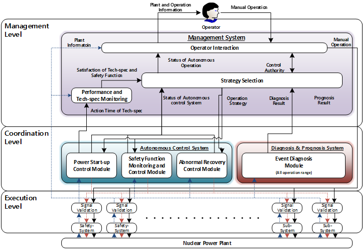
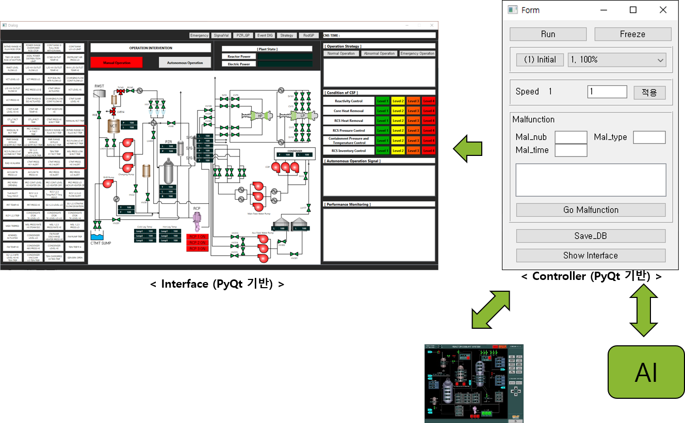

# ERC_Project

# CNS 자율 운전 알고리즘

---

- **CNS 자율 운전 프레임 워크**

---

- **자율 운전 프레임워크 기반으로 개발된 플랫폼**

---

## 1. 기능

...

## 2. 시스템 및 라이브러리 요구사항

- Compact Nuclear Simulator (CNSOne_2021_xx_xx.tar 버전이상)
- Python 3.8.x 이상
- Pytorch (1.7.0+cu110)
- Tensorflow () & Keras (2.4.3)
- PyQt5

